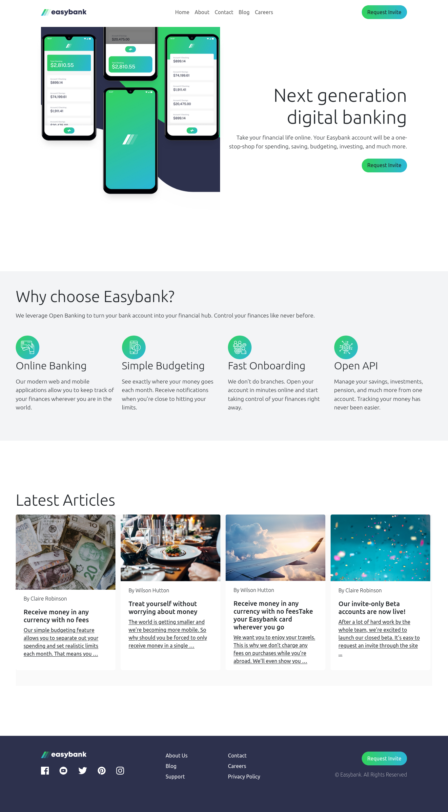

# Frontend Mentor - Easybank landing page solution

This is a solution to the [Easybank landing page challenge on Frontend Mentor](https://www.frontendmentor.io/challenges/easybank-landing-page-WaUhkoDN). Frontend Mentor challenges help you improve your coding skills by building realistic projects. 

## Table of contents

- [Overview](#overview)
  - [The challenge](#the-challenge)
  - [Screenshot](#screenshot)
  - [Links](#links)
- [My process](#my-process)
  - [Built with](#built-with)
- [Author](#author)

## Overview

### The challenge

Users should be able to:

- View the optimal layout for the site depending on their device's screen size
- See hover states for all interactive elements on the page

### Screenshot

### Links

 - [Solution @ frontendmentor.io](https://your-solution-url.com)
 - [Live Site](https://seyi-amusan.github.io/easybank-landing-page/)

## My process

### Built with

- Semantic HTML5 markup
- CSS custom properties
- Bootstrap
- JavaScript
- Mobile-first workflow

## Author

- Upwork - [Seyi-Amusan](https://www.upwork.com/freelancers/~010722464f8f321738?mp_source=share)
- Frontend Mentor - [Seyi-Amusan](https://www.frontendmentor.io/profile/Seyi-Amusan)

